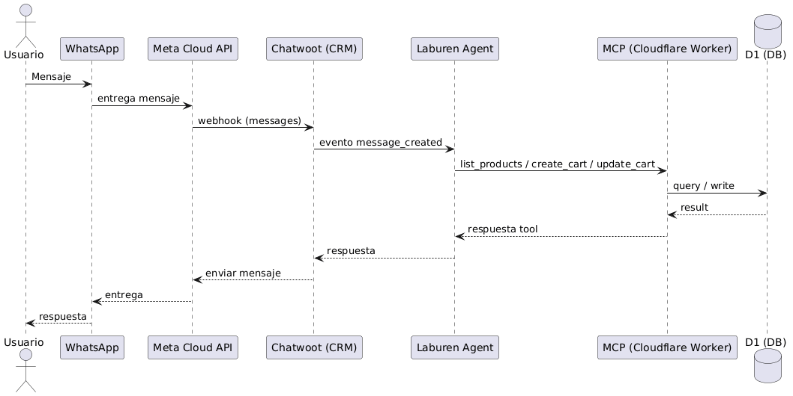

# Overview — Arquitectura End-to-End

> Documento conceptual (máx. 2 páginas): componentes, endpoints y flujo de interacción.

## Arquitectura (componentes)

## Flujo end-to-end (secuencia)

## Endpoints / tools (MCP)
Tools expuestas por el MCP (consumidas por el Agent Runtime):

**Catálogo**
- `list_products`
- `list_facets`
- `get_product_details`
- `get_products_by_ids`

**Pricing**
- `quote_price`

**Carrito**
- `create_cart`
- `update_cart`
- `get_cart`
- `validate_cart`

**CRM (Chatwoot)**
- `add_labels`
- `handoff_to_human`

> Detalle funcional y contratos: `./01_mcp_cloudflare.md`

## Modelo Relacional (D1 — `laburen_challenge`)

## Decisiones del agente (búsquedas y filtros)

## Estados del carrito (por conversation_id)

## Relación tools → tablas (responsabilidades)

## Docs extendidos
- 01 — MCP & Cloudflare: `./01_mcp_cloudflare.md`
- 02 — Base de datos (D1): `./02_db.md`
- 03 — Agente (Laburen): `./03_agenteLaburen.md`
- 04 — Integración WhatsApp: `./04_integracion_whatsapp.md`
