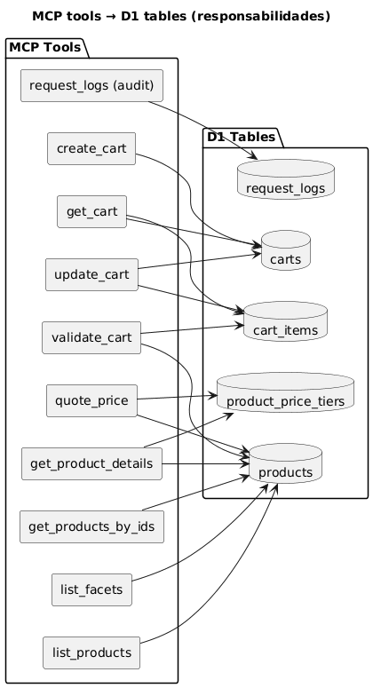

# MCP (Model Context Protocol) — Cloudflare Worker

## Objetivo
Este proyecto implementa un **MCP propio** para que el agente de Laburen pueda ejecutar y mantener una conversación coherente .  

>**MCP esté desplegado en Cloudflare**.

---
## Arquitectura general
> Ver arquitectura general: [00_overview.md](./00_overview.md)
---
## Relación Tools MCP ↔ Base de datos (D1)
Este diagrama muestra qué herramientas interactúan con cada tabla (catalogo, carrito y auditoría).

## Qué resuelve el MCP
El MCP es el backend “operativo” del agente. Expone herramientas que permiten:

- **Explorar productos** (con filtros, paginación y total).
- **Ver detalles** de un producto (incluye tiers de precio si aplica).
- **Cotizar precio por cantidad** (aplica reglas de pricing desde backend).
- **Crear y gestionar un carrito por conversación** (add/set/remove/clear).
- **Validar carrito** (stock insuficiente, productos no disponibles).
- **Etiquetar conversaciones en el CRM** (Chatwoot) y **derivar a humano**.
---

## Herramientas (tools) expuestas por el MCP
> Nota: estos nombres son los que consume el agente desde Laburen.

### Catálogo / Productos
- `list_products`: lista productos con filtros opcionales (texto, disponibilidad, stock, talle, color, etc.) + paginación.
- `list_facets`: devuelve valores reales del catálogo (talles, colores, categorías, etc.) para desambiguar.
- `get_product_details`: detalle por ID (+ tiers de precio si existen).
- `quote_price`: calcula precio por cantidad (backend autoritativo).
- `get_products_by_ids`: fetch por lista de IDs conservando el orden.

### Carrito (1 por conversación)
- `create_cart`: crea/reutiliza carrito asociado a `conversation_id`.
- `update_cart`: actualiza carrito con acciones `add | set | remove | clear` (soporta batch).
- `get_cart`: devuelve estado del carrito (items + totales).
- `validate_cart`: detecta stock insuficiente/no disponible y sugiere ajustes.

### CRM (Chatwoot)
- `add_labels`: agrega labels a la conversación (merge, sin pisar).
- `handoff_to_human`: deriva a humano (aplica label y devuelve texto de handoff).

---

## Contratos funcionales (comportamiento observable)

### 1) Estado por conversación
- El carrito queda asociado a un `conversation_id`.
- Esto permite que el agente recuerde el carrito durante toda la conversación.

### 2) Validación de stock y disponibilidad
- En operaciones de carrito se valida:
  - existencia de producto
  - disponibilidad/vendibilidad
  - stock suficiente para la cantidad final
- Ante conflictos, el MCP devuelve un error claro por item y el estado del carrito actualizado (cuando aplica).

### 3) Respuesta estándar MCP
Todas las tools responden con una estructura consistente que incluye:
- `structuredContent`: resultado en JSON utilizable por el agente
- `content`: fallback textual para lectura/debug
- `isError`: marca de error cuando corresponde

---

## Seguridad (Auth)
El endpoint del MCP soporta autenticación por token:
- Valida `Authorization: Bearer <token>` .
- El control puede configurarse para entornos de demo/test (auth habilitado o deshabilitado según configuración).
- En despliegues públicos/producción, se recomienda mantenerlo habilitado para evitar consumo no autorizado del Worker.

---

## Configuración aplicada en Cloudflare (bindings + env vars)

### Variables / bindings en uso
- `DB`: binding de base de datos (Cloudflare D1) usado por products/carts/cart_items (y logs si aplica).
- `CHATWOOT_BASE_URL`: base URL de Chatwoot (CRM).
- `CHATWOOT_ACCOUNT_ID`: account del workspace para operar conversaciones/labels.
- `CHATWOOT_API_TOKEN`: token para operaciones vía API de Chatwoot.

### Variables opcionales activables
- `MCP_AUTH_TOKEN`: token bearer para proteger el endpoint del MCP.
- `MCP_AUTH_DISABLED`: flag para desactivar auth en entornos de test (si aplica).
- `LOG_BODY_MAX`: límite de tamaño para logueo seguro.
- `LOG_TO_DB`: habilita auditoría persistente en DB (si está habilitado).

> En el repositorio/documentación los secretos se encuentran **enmascarados** y se cargan como **secrets** en el entorno de Cloudflare.

---

## Relación MCP ↔ CRM ↔ Canal (contexto)
En el flujo real, el agente consume MCP y el CRM refleja estado mediante etiquetas.
En mi integración end-to-end (WhatsApp Cloud API → Chatwoot → Agent → MCP), el agente consume MCP para `list_products`, `create_cart`, `update_cart`, etc. 

> La documentación del canal WhatsApp (capturas + configuración) está en `integracionWhatsapp.md`. 
