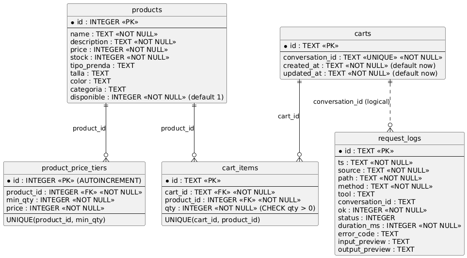

# Base de datos (Cloudflare D1) — `laburen_challenge`

## Objetivo
Persistir el **estado operativo** del agente:
- Catálogo de productos (y sus tiers de precio)
- Carrito por conversación (`conversation_id`)
- Auditoría de requests al MCP (`request_logs`)

> La base de datos corre sobre **Cloudflare D1 (SQLite)** y está bindeada al Worker como `DB`.

---

## Modelo relacional


---

## Tablas

### `products`
Catálogo base consumido por `list_products`, `get_product_details`, `get_products_by_ids`.

Campos principales:
- `id` (PK)
- `name`, `description`
- `price` (precio base)
- `stock` (stock numérico)
- atributos opcionales: `tipo_prenda`, `talla`, `color`, `categoria`
- `disponible` (flag vendible del catálogo)

### `product_price_tiers`
Tiers de pricing por cantidad (extra del challenge).
- `product_id` (FK → `products.id`)
- `min_qty` (cantidad mínima para aplicar tier)
- `price` (precio unitario para ese tier)
- único por `(product_id, min_qty)`

Usada por:
- `quote_price`
- `get_product_details` (cuando incluye tiers)

### `carts`
Un carrito por conversación (1:1 con `conversation_id`).
- `id` (PK, texto/uuid)
- `conversation_id` (UNIQUE)
- timestamps: `created_at`, `updated_at`

Usada por:
- `create_cart`
- `get_cart`

### `cart_items`
Items dentro del carrito (muchos por carrito).
- `id` (PK)
- `cart_id` (FK → `carts.id`)
- `product_id` (FK → `products.id`)
- `qty` (cantidad > 0)
- único por `(cart_id, product_id)` para evitar duplicados

Usada por:
- `update_cart`
- `get_cart`
- `validate_cart`

### `request_logs`
Auditoría de requests al MCP (observabilidad / debugging).
Campos:
- metadatos (`ts`, `source`, `path`, `method`, `tool`)
- contexto (`conversation_id`)
- resultado (`ok`, `status`, `duration_ms`, `error_code`)
- previews (`input_preview`, `output_preview`)

Índices:
- `idx_request_logs_ts`
- `idx_request_logs_source`
- `idx_request_logs_conv`

---

## Consultas útiles (Wrangler)

Listar tablas:
```bash
wrangler d1 execute laburen_challenge --command "SELECT name FROM sqlite_master WHERE type='table' ORDER BY name;"
wrangler d1 execute laburen_challenge --remote --command "SELECT name FROM sqlite_master WHERE type='table' ORDER BY name;"
```

Ver schema de una tabla:
```bash
wrangler d1 execute laburen_challenge --command "SELECT sql FROM sqlite_master WHERE type='table' AND name='products';"
```

Ver FKs de `cart_items`:
```bash
wrangler d1 execute laburen_challenge --command "PRAGMA foreign_key_list('cart_items');"
```

> La creación de tablas está centralizada en `schema.sql`.
