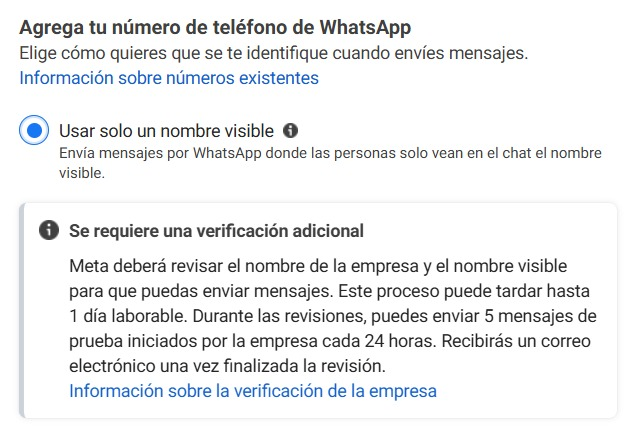
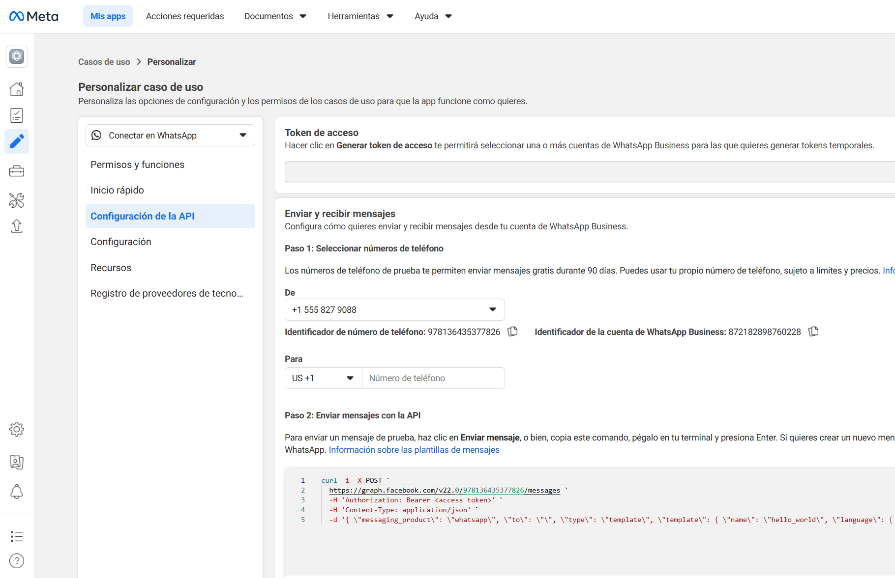
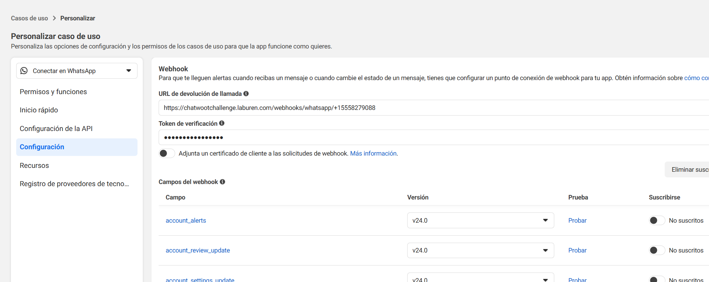
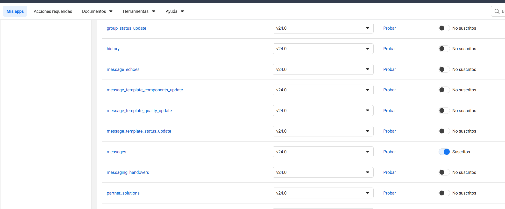
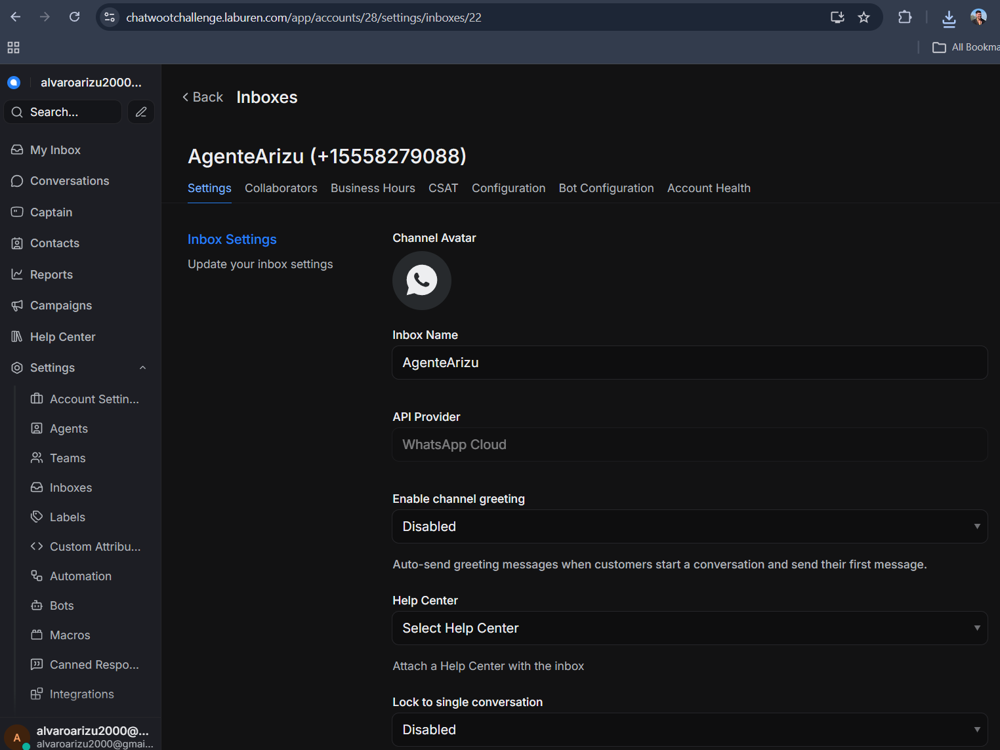
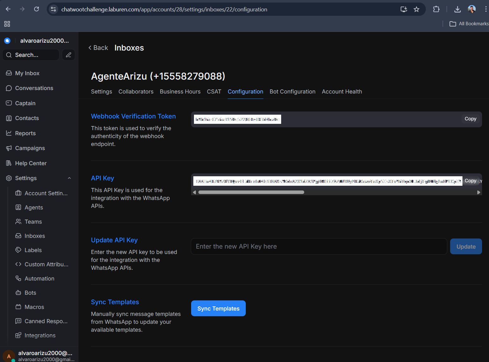
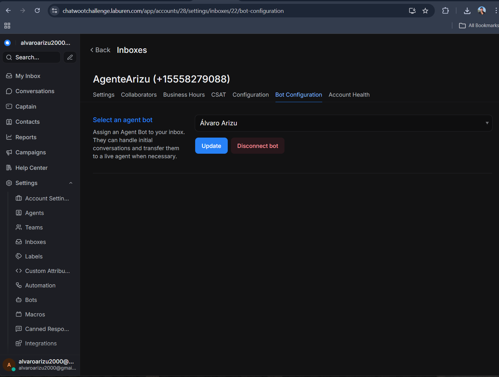
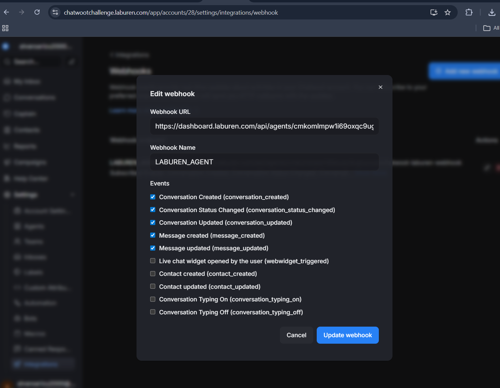
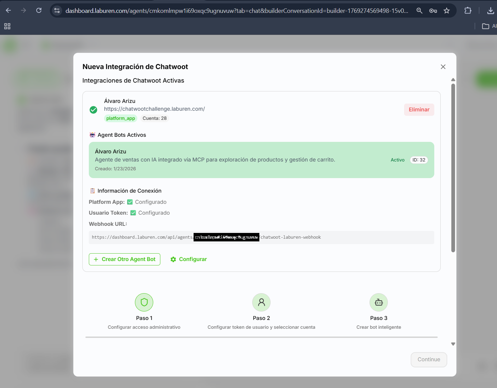

# Integración WhatsApp (Meta Cloud API) ↔ Chatwoot (CRM Laburen) ↔ Agente (Laburen)

## Objetivo
El challenge requiere que la **interfaz esté desplegada en WhatsApp** y conectada mediante la instancia de **Chatwoot de Laburen**.  
En esta sección documento la integración end-to-end:
**Meta WhatsApp Cloud API → Webhook → Chatwoot Inbox → Agent Bot (Laburen) → respuestas al usuario**.

---
## Arquitectura general
> Ver arquitectura general: [00_overview.md](./00_overview.md)
---

## Estado actual 
-  Meta App configurada con **WhatsApp Cloud API**.
-  Envío/recepción de mensajes con el número de WhatsApp Cloud.
-  Webhook configurado en Meta apuntando a Chatwoot.
-  Chatwoot tiene un **Inbox WhatsApp Cloud** operativo y asociado al agente.
-  El agente responde y consume el MCP desde la plataforma de Laburen.

---

## Limitación actual (entorno de prueba / verificación Meta)
Actualmente estoy usando un **número de prueba** de WhatsApp Cloud API.
Meta aplica una **verificación adicional** y, mientras está en modo prueba/revisión, permite **hasta 5 mensajes de prueba iniciados por la empresa cada 24hs** (según UI de Meta).  
Esto limita el volumen de testing, pero **la integración técnica y el flujo completo están implementados y demostrables** con esas ventanas de mensajes.

> Importante: esta limitación es de **Meta/WhatsApp Cloud API** (cuenta/número), no del agente ni del MCP.

---

## Flujo de integración (alto nivel)
1) Usuario envía mensaje a WhatsApp del negocio.  
2) Meta entrega el evento a mi **Webhook**.  
3) Chatwoot recibe el evento y crea/actualiza conversación en el inbox.  
4) El inbox dispara el Agente Laburen.  
5) El agente responde (y consume MCP: `list_products`, `create_cart`, `update_cart`, etc.).  
6) Chatwoot envía la respuesta a Meta y Meta la entrega a WhatsApp.

---

## Configuración en Meta (WhatsApp Cloud API)

### 1) Token + IDs (Phone Number ID / WABA ID)
En **Configuración de la API** se obtiene:
- `Phone Number ID`
- `WhatsApp Business Account ID (WABA)`
- `Access Token` 

**Evidencia:**  
-  Pantalla de “Configuración de la API” con número de prueba, IDs y ejemplo de `curl` para enviar mensajes.
  
 

> Seguridad: enmascarar el token en el repo/documentación.

### 2) Webhook de WhatsApp → Chatwoot
En la sección **Webhook** de Meta:
- `Callback URL`: endpoint de Chatwoot para WhatsApp (ej: `https://chatwootchallenge.laburen.com/webhooks/whatsapp/<phone>`)
- `Verify Token`: debe coincidir con el **Webhook Verification Token** que informa Chatwoot para ese inbox.

**Evidencia:**  
 

>Configuración del webhook (Callback URL + Verify Token).

### 3) Suscripción a eventos
En “Campos del webhook”, subscribo al menos:
- `messages` (necesario para recibir mensajes)

**Evidencia:**  
 
  
  >Suscripción a `messages` en estado “Suscritos”.

---

## Configuración en Chatwoot (Inbox WhatsApp Cloud)

### 4) Inbox Settings
En Chatwoot se crea/usa un Inbox tipo **WhatsApp Cloud** con:
- Nombre del inbox
- Provider: WhatsApp Cloud

**Evidencia:**  
 
  >Inbox creado (ej: “AgenteArizu (+1555...)”) y provider.

### 5) Configuration: Verification Token + API Key
En **Inbox → Configuration**:
- `Webhook Verification Token`: se usa para validar la suscripción en Meta
- `API Key / Access Token`: token para operar contra la API (en Chatwoot aparece como API Key)

**Evidencia:**  
 

>“Webhook Verification Token” + “API Key” + Sync Templates.

> Seguridad: enmascarar API Key en capturas públicas.

### 6) Bot Configuration
Asocio el inbox a mi **Agent Bot** (Laburen) para que atienda conversaciones.

**Evidencia:**  
 

>“Select an agent bot” con mi bot seleccionado.

---

## Integración Chatwoot ↔ Laburen (Agente)
El challenge indica configurar Chatwoot en Laburen con `Chatwoot Server URL` y `Platform App Token`.

**Evidencia:**  
 
> Modal de “Nueva Integración de Chatwoot” en dashboard de Laburen, mostrando conexión configurada y bot activo.

---

## Webhooks internos (Chatwoot → Laburen)
Para que Laburen procese eventos de conversación/mensajes desde Chatwoot, está configurado el webhook (ej: `dashboard.laburen.com/api/agents/.../chatwoot-laburen-webhook`) con eventos típicos:
- `conversation_created`
- `message_created`
- etc.

**Evidencia:**  

>Configuración del webhook en Chatwoot con eventos seleccionados.

---

