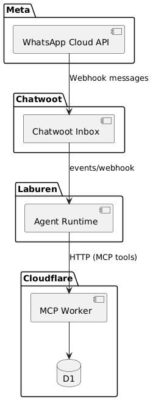
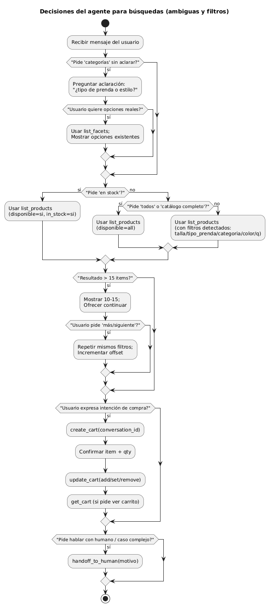
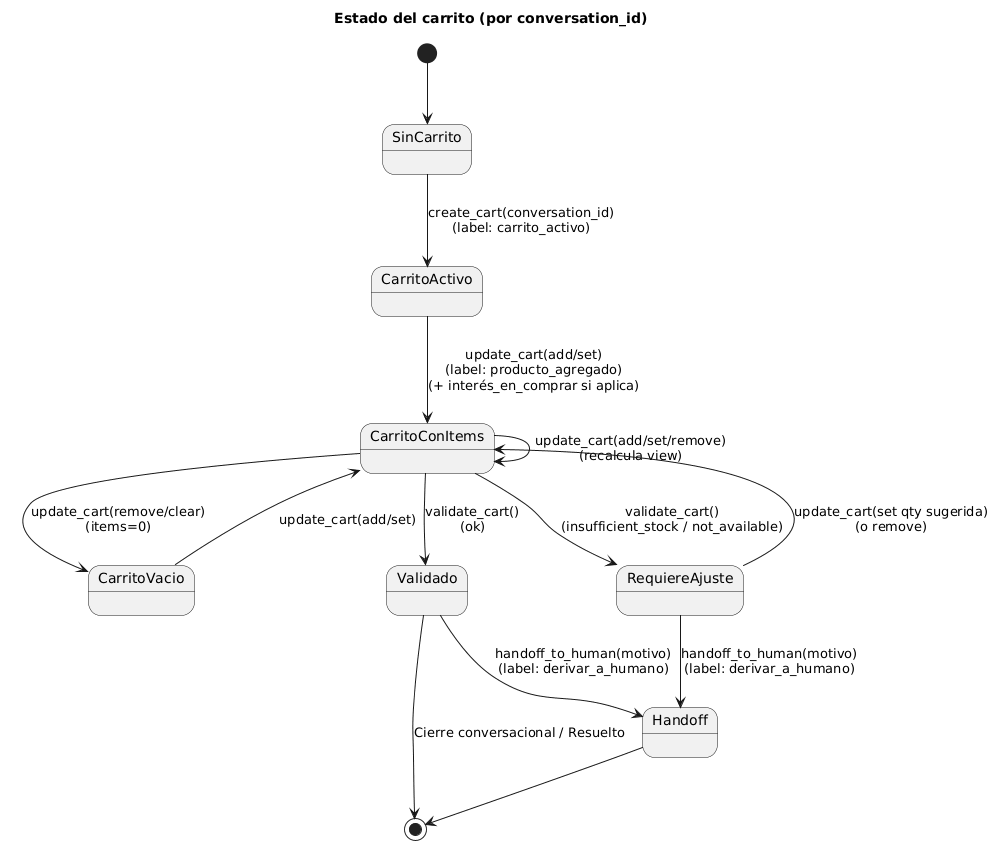

# Fase conceptual — Diseño del Agente + Endpoints (2 páginas)

## Qué hace el agente
El agente actúa como **asistente de ventas** por WhatsApp:
1) Explora productos según intención y filtros.
2) Crea un carrito por conversación.
3) Agrega / actualiza / elimina ítems del carrito.
4) (Extra) Valida el carrito antes del cierre (stock / disponibilidad).
5) Si el caso es complejo, deriva a humano en Chatwoot.

---

## Endpoints / tools (MCP)
- `list_products` — búsqueda con filtros + paginación + total  
- `list_facets` — opciones reales del catálogo para desambiguar (talles/colores/categorías)  
- `get_product_details` — detalle por ID (incluye tiers si existen)  
- `get_products_by_ids` — batch por IDs (mantiene orden)  
- `quote_price` — pricing por cantidad (backend autoritativo)  
- `create_cart` — crea/reutiliza carrito por `conversation_id`  
- `update_cart` — `add | set | remove | clear` (valida stock)  
- `get_cart` — estado del carrito (items + totales)  
- `validate_cart` — detecta inconsistencias (insufficient_stock / not_available)  
- `handoff_to_human` — derivación a operador (Chatwoot)  
- `add_labels` — etiquetado manual (si hace falta)

---

## Diagramas
### Flujo end-to-end (secuencia)

### Decisiones del agente (búsquedas y filtros)

### Estados del carrito

